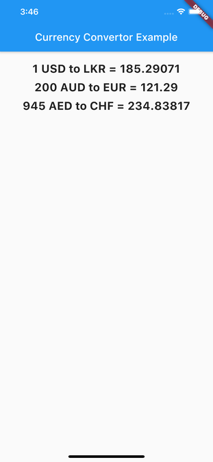

# flutter_currency_converter

A Flutter plugin for converting the currencies.



## Getting Started

This project is a starting point for a Flutter
[plug-in package](https://flutter.dev/developing-packages/),
a specialized package that includes platform-specific implementation code for
Android and/or iOS.

For help getting started with Flutter, view our
[online documentation](https://flutter.dev/docs), which offers tutorials,
samples, guidance on mobile development, and a full API reference.


## Installation
 - Pub get
```dart
flutter_currency_converter: ^0.0.1
```
 - Import

```dart
import 'package:flutter_currency_converter/flutter_currency_converter.dart';
import 'package:flutter_currency_converter/Currency.dart';
```

## Using
 - Call FlutterCurrencyConverter.convert
 - The convert method required two parameters. These are From and To Currency objects.
 - The Currency objects must have Currency types.
 - For the From Currency object can add the amount as an optional parameter. Otherwise, it always returns the value for 1 unit.
```dart
 await FlutterCurrencyConverter.convert(
        Currency(Currency.USD), Currency(Currency.LKR));

 await FlutterCurrencyConverter.convert(
        Currency(Currency.AUD,amount: 100), Currency(Currency.CHF));

  ```

## Authors

* [ShehanRashmika](https://github.com/ShehanRashmika)

## API

* [Free Currency Converter Api](https://free.currencyconverterapi.com)